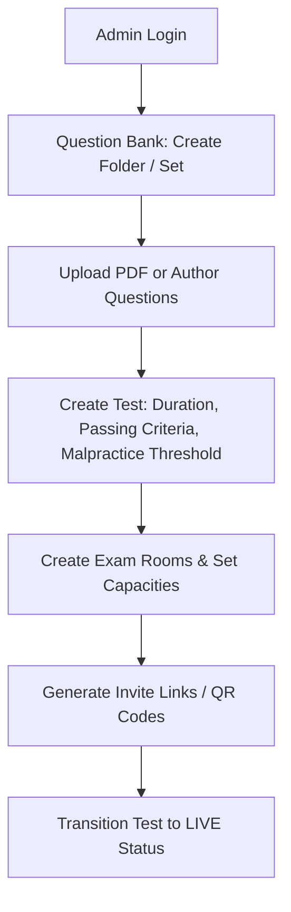
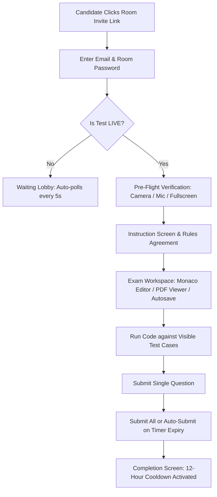
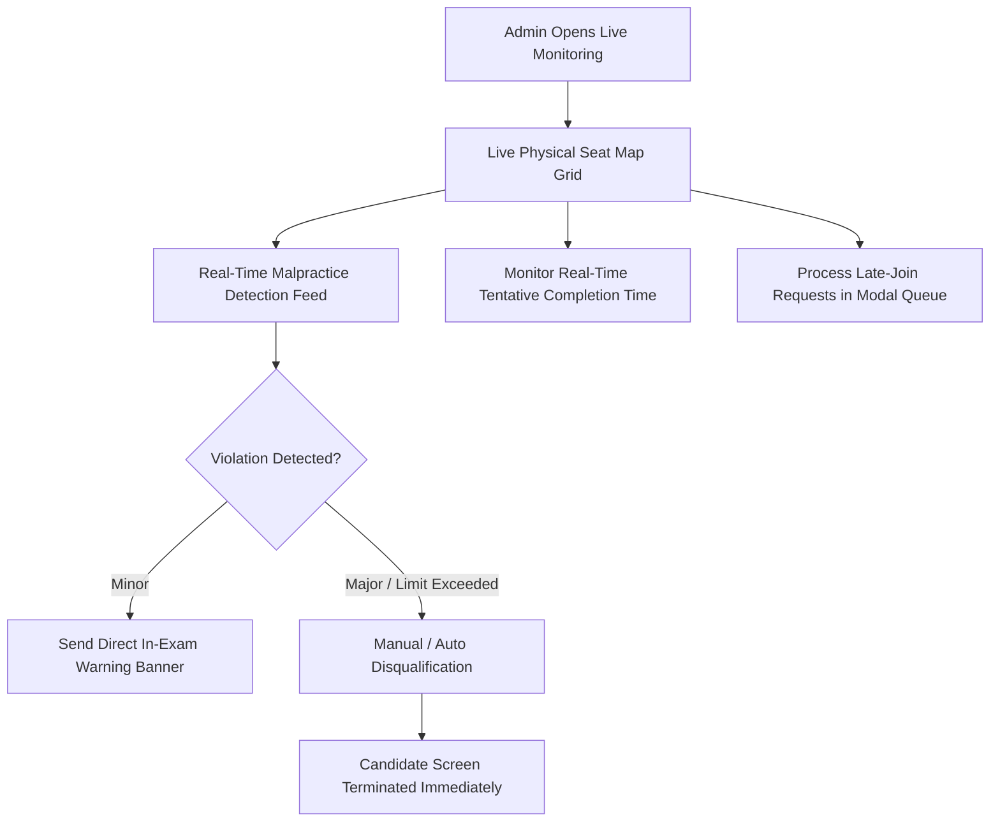

# Smart AI SPOJ Test Platform — Comprehensive Feature Documentation (DOC-001)

**Document Reference**: DOC-001  
**Platform**: Smart AI SPOJ Test & Proctoring Platform  
**Target Audience**: Non-Technical Product Owners (Primary), Software Engineering & QA Teams (Secondary)  
**Verification Method**: 100% Code-Verified against Local Repository & Live Production Runtime  
**Git Baseline Commit**: `26bac7edc47a6904d77fe12cd809712c4f36cd9f`  
**Date of Audit**: September 28, 2026  

---

## 1. Executive Summary

The **Smart AI SPOJ Test Platform** is an enterprise-grade, web-based technical assessment and automated proctoring platform designed to conduct secure, scalable, and multi-room coding examinations. The system supports multiple programming languages (JavaScript, Python, C++, Java, C), full-stack project building tests (AI Test), real-time physical seat map monitoring, automated anti-malpractice detection, sandboxed code execution via Judge0, automated scoring, and ranking/shortlist generation.

### Feature Status Summary Table

| Category | Feature Name | Status | Summary Description |
| :--- | :--- | :--- | :--- |
| **Admin Panel** | Admin Authentication & RBAC | `WORKING` | Secure JWT-based admin access with 3 distinct operational roles (`SUPER_ADMIN`, `ADMIN`, `PROCTOR`). |
| **Admin Panel** | Dashboard & System Analytics | `WORKING` | Operational stat cards, quick test management links, and live service status indicators. |
| **Admin Panel** | Question Bank & PDF Extraction | `WORKING` | Multi-folder question organizer with automatic text extraction from uploaded PDF problem sheets. |
| **Admin Panel** | Test Lifecycle Management | `WORKING` | End-to-end test state machine (`DRAFT` $\rightarrow$ `UPCOMING` $\rightarrow$ `LIVE` $\rightarrow$ `ENDED`) with auto-conclusion. |
| **Admin Panel** | Room Management & Distribution | `WORKING` | Multi-room partitioning with automated password generation, access windows, and direct links. |
| **Admin Panel** | Live Physical Seat Map & Proctoring | `WORKING` | Real-time candidate seat status grid, live violation counters, and tentative test completion timers. |
| **Admin Panel** | Proactive Interventions & Late Joins | `WORKING` | Real-time late-join approval queue, in-exam warning messages, and manual disqualification actions. |
| **Admin Panel** | Candidate Inspection & Evidence | `WORKING` | Live webcam snapshot viewer, split-screen code inspector, and full-resolution proof zoom modal. |
| **Admin Panel** | Test Results & Detailed Evaluation | `WORKING` | Candidate score rosters, question-level evaluation modal, and split-screen rubric views. |
| **Admin Panel** | Shortlist Generation & Export | `WORKING` | Automated candidate ranking by normalized score with malpractice and passing criteria filtering. |
| **Admin Panel** | Settings, Profiles & Theme Toggle | `WORKING` | Sub-account admin creation and persistent dark/light theme switching. |
| **Candidate Portal** | Candidate Registration & Login | `WORKING` | Email-only onboarding with persistent candidate JWT session management. |
| **Candidate Portal** | Room Entry & Waiting Lobby | `WORKING` | Direct link / room code entry, pre-test waiting lobby, and late-join approval polling. |
| **Candidate Portal** | Hardware Pre-Flight Verification | `WORKING` | Automated webcam, microphone, and fullscreen permission checks prior to exam entry. |
| **Candidate Portal** | Coding Exam Interface | `WORKING` | Monaco editor, multi-language execution, custom input runner, split PDF viewer, and autosave. |
| **Candidate Portal** | AI Project Exam Interface | `WORKING` | Multi-file project workspace (`index.html`, `style.css`, `script.js`) with live preview and AI chat pane. |
| **Candidate Portal** | Test Submission & Auto-Submit | `WORKING` | Single-question submit, submit-all confirmation, and automatic time-up/disqualification submission. |
| **Candidate Portal** | 12-Hour Cooldown & Recovery | `WORKING` | Automatic 12-hour retest prevention and resilient session recovery across page refreshes. |
| **Proctoring** | Fullscreen Integrity Enforcement | `WORKING` | Real-time detection of fullscreen exits with automated malpractice logging. |
| **Proctoring** | Tab-Switch & Focus Tracking | `WORKING` | Background tab switching and window blur detection with proof timestamping. |
| **Proctoring** | Client-Side Face & Gaze Tracking | `WORKING` | Browser-based AI detection for continuous face absence (>15s) and multiple faces in webcam frame. |
| **Proctoring** | Camera Disconnect Tracking | `WORKING` | Hardware disconnection detection with cumulative outage duration calculation upon submit. |
| **Proctoring** | Peripheral & Shortcut Restrictions | `WORKING` | Blocks copy-paste (`Ctrl+C`/`Ctrl+V`), `Alt+Tab`, developer tools (`F12`), and context menus. |
| **Proctoring** | Evidence Capture & Upload | `WORKING - NEEDS CONFIG` | Captures webcam violation frames; requires Cloudinary credentials for cloud storage (uses Base64 fallback). |
| **Proctoring** | Malpractice Auto-Disqualification | `WORKING` | Configurable violation threshold triggering immediate test termination and admin alerts. |
| **Evaluation** | Sandboxed Execution (Judge0) | `WORKING - NEEDS CONFIG` | Executes code against test cases in isolated containers; requires active Judge0 host. |
| **Evaluation** | "Qs Solved" Determination | `WORKING` | Sets questions completed count to $1.0$ if all visible test cases pass, else $0.0$. |
| **Evaluation** | Standard Coding Scoring Formula | `WORKING` | Weighted composite score: 30% Correctness + 10% Pass % + 60% Code Quality Rubric. |
| **Evaluation** | AI Evaluation | `WORKING - NEEDS CONFIG` | 8-Criteria code evaluation via LLM; requires active API key (falls back to baseline 5/10 when unconfigured). |
| **Evaluation** | AI Test Scoring Formula | `WORKING` | Composite score: 60% Prompt Quality (LLM) + 40% Output Correctness (Heuristic DOM validator). |
| **Evaluation** | Pass/Fail Aggregation Rule | `WORKING` | Evaluates total questions solved against test-configured `passingCriteria`. |
| **Evaluation** | Shortlist Ranking Algorithm | `WORKING` | 3-Step clean rebuild ranking candidates descending by average score. |
| **Platform** | Architecture & Hosting | `WORKING` | Distributed topology: React/Vite (Vercel), Node.js (Render), MongoDB Atlas. |
| **Platform** | Real-Time WebSocket Engine | `WORKING` | Low-latency Socket.io protocol for live proctoring, seat maps, alerts, and timers. |
| **Platform** | PDF Text Extraction Service | `WORKING` | Server-side parsing of problem sheets into structured titles and test cases. |
| **Platform** | Data Models & Schema Registry | `WORKING` | 11 Normalized MongoDB collections with automatic indexing. |
| **Platform** | Environment Variable Engine | `WORKING` | Centralized configuration dictionary with graceful fallbacks. |

---

## 2. User Roles & Access Control Matrix

The platform implements a Role-Based Access Control (RBAC) architecture enforced at the API route level via `adminAuth` middleware ([`adminAuth.js:7-38`](file:///c:/Users/GLB-BLR-112/Desktop/spoj%20test%20website/ai-proctored-test-platform/server/src/middleware/adminAuth.js#L7-L38)) and candidate authentication middleware ([`candidateAuth.js:7-35`](file:///c:/Users/GLB-BLR-112/Desktop/spoj%20test%20website/ai-proctored-test-platform/server/src/middleware/candidateAuth.js#L7-L35)).

| System Capability | `SUPER_ADMIN` | `ADMIN` | `PROCTOR` | `CANDIDATE` |
| :--- | :---: | :---: | :---: | :---: |
| **Create / Delete Admin Accounts** | ✅ | ❌ | ❌ | ❌ |
| **Create, Edit & Delete Tests** | ✅ | ✅ | ❌ | ❌ |
| **Upload & Manage Question Bank** | ✅ | ✅ | ❌ | ❌ |
| **Create & Configure Exam Rooms** | ✅ | ✅ | ❌ | ❌ |
| **Transition Test Lifecycle (`LIVE`/`ENDED`)** | ✅ | ✅ | ❌ | ❌ |
| **View Live Monitoring & Seat Map** | ✅ | ✅ | ✅ | ❌ |
| **Issue Candidate In-Exam Warnings** | ✅ | ✅ | ✅ | ❌ |
| **Manually Disqualify Candidate** | ✅ | ✅ | ✅ | ❌ |
| **Approve / Reject Late Joins** | ✅ | ✅ | ✅ | ❌ |
| **View Detailed Evaluation & Inspect Code** | ✅ | ✅ | ✅ | ❌ |
| **Export Results & Shortlists (CSV)** | ✅ | ✅ | ❌ | ❌ |
| **Register & Join Assigned Room** | ❌ | ❌ | ❌ | ✅ |
| **Execute Code in Sandboxed Editor** | ❌ | ❌ | ❌ | ✅ |
| **Submit Single Question / Final Exam** | ❌ | ❌ | ❌ | ✅ |

---

## 3. End-to-End User Workflows

### 3.1 Admin Setup Workflow


### 3.2 Candidate Exam Day Workflow


### 3.3 Live Proctoring & Interventions Workflow


---

## 4. Comprehensive Feature Catalogue

### Section A: Admin Panel & Test Operations

#### 1. Admin Authentication & Role-Based Access Control (RBAC)
- **What it does**: Provides secure email/password authentication for administrators, issuing signed JSON Web Tokens (JWT) that expire after 24 hours. Enforces role-based permissions separating platform owners (`SUPER_ADMIN`), test managers (`ADMIN`), and live proctors (`PROCTOR`).
- **Who uses it**: Admin personnel.
- **Where to find it**: `/admin/login`, `/admin/admins`.
- **How it works**: Validates credentials against hashed passwords stored in MongoDB via `bcryptjs`. Attaches admin role and ID to `req.user`. Non-superadmins are blocked from user administration routes.
- **Depends on**: MongoDB, `JWT_SECRET` environment variable.
- **Status**: `WORKING` (Verified via [`authController.js:14-55`](file:///c:/Users/GLB-BLR-112/Desktop/spoj%20test%20website/ai-proctored-test-platform/server/src/controllers/authController.js#L14-L55) and [`adminAuth.js:7-38`](file:///c:/Users/GLB-BLR-112/Desktop/spoj%20test%20website/ai-proctored-test-platform/server/src/middleware/adminAuth.js#L7-L38)).
- **Code location**: [`server/src/controllers/authController.js`](file:///c:/Users/GLB-BLR-112/Desktop/spoj%20test%20website/ai-proctored-test-platform/server/src/controllers/authController.js), [`server/src/middleware/adminAuth.js`](file:///c:/Users/GLB-BLR-112/Desktop/spoj%20test%20website/ai-proctored-test-platform/server/src/middleware/adminAuth.js).
- **Notes / limitations**: Password minimum length is 6 characters. Tokens expire in 24 hours (`24h`).

#### 2. Admin Dashboard & System Analytics
- **What it does**: Presents a high-level operational overview displaying aggregate statistics on active live tests, total tests created, total question sets, and completed assessments. Provides quick-action links to create tests, manage question banks, and administer user accounts.
- **Who uses it**: Admin.
- **Where to find it**: `/admin/dashboard`.
- **How it works**: Aggregates document counts across MongoDB collections (`Test`, `QuestionSet`, `Submission`). Displays a status overview card of core system services.
- **Depends on**: MongoDB database connection.
- **Status**: `WORKING` (Verified via [`dashboardController.js:16-52`](file:///c:/Users/GLB-BLR-112/Desktop/spoj%20test%20website/ai-proctored-test-platform/server/src/controllers/dashboardController.js#L16-L52) and [`AdminDashboard.jsx`](file:///c:/Users/GLB-BLR-112/Desktop/spoj%20test%20website/ai-proctored-test-platform/client/src/admin/pages/AdminDashboard.jsx)).
- **Code location**: [`server/src/controllers/dashboardController.js`](file:///c:/Users/GLB-BLR-112/Desktop/spoj%20test%20website/ai-proctored-test-platform/server/src/controllers/dashboardController.js), [`client/src/admin/pages/AdminDashboard.jsx`](file:///c:/Users/GLB-BLR-112/Desktop/spoj%20test%20website/ai-proctored-test-platform/client/src/admin/pages/AdminDashboard.jsx).
- **Notes / limitations**: Real-time counter updates on page mount and refresh.

#### 3. Question Bank & PDF Extraction
- **What it does**: Organizes assessment content into Folders and Question Sets. Allows administrators to manually create coding problems or upload PDF files to automatically extract problem descriptions, sample inputs, and expected outputs.
- **Who uses it**: Admin.
- **Where to find it**: `/admin/question-bank`.
- **How it works**: Stores folders and sets hierarchically. Uploaded PDFs are parsed server-side using `pdf-parse` in [`pdfExtractionService.js`](file:///c:/Users/GLB-BLR-112/Desktop/spoj%20test%20website/ai-proctored-test-platform/server/src/services/pdfExtractionService.js). Text is cleaned of redundant PDF metadata prefixes and regex-matched for problem statements, visible test cases, and hidden test cases.
- **Depends on**: `pdf-parse` library, MongoDB.
- **Status**: `WORKING` (Verified via [`questionController.js:250-320`](file:///c:/Users/GLB-BLR-112/Desktop/spoj%20test%20website/ai-proctored-test-platform/server/src/controllers/questionController.js#L250-L320)).
- **Code location**: [`server/src/controllers/questionController.js`](file:///c:/Users/GLB-BLR-112/Desktop/spoj%20test%20website/ai-proctored-test-platform/server/src/controllers/questionController.js), [`server/src/services/pdfExtractionService.js`](file:///c:/Users/GLB-BLR-112/Desktop/spoj%20test%20website/ai-proctored-test-platform/server/src/services/pdfExtractionService.js).
- **Notes / limitations**: Maximum PDF upload file size is 10MB (`10 * 1024 * 1024` bytes).

#### 4. Test Lifecycle & Configuration Management
- **What it does**: Enables creation and lifecycle management of tests. Administrators configure test titles, descriptions, durations in minutes, passing criteria (minimum questions to solve), malpractice disqualification thresholds, and supported programming languages.
- **Who uses it**: Admin.
- **Where to find it**: `/admin/tests`, `/admin/tests/:testId`.
- **How it works**: Enforces a 4-state lifecycle machine (`DRAFT` $\rightarrow$ `UPCOMING` $\rightarrow$ `LIVE` $\rightarrow$ `ENDED`). When transitioned to `LIVE`, room join windows open and candidate attempts begin. Tests auto-conclude when all enrolled candidates submit or time expires.
- **Depends on**: MongoDB, `testLifecycleService.js`, Socket.io.
- **Status**: `WORKING` (Verified via [`testController.js:15-180`](file:///c:/Users/GLB-BLR-112/Desktop/spoj%20test%20website/ai-proctored-test-platform/server/src/controllers/testController.js#L15-L180) and [`testLifecycleService.js:15-110`](file:///c:/Users/GLB-BLR-112/Desktop/spoj%20test%20website/ai-proctored-test-platform/server/src/services/testLifecycleService.js#L15-L110)).
- **Code location**: [`server/src/controllers/testController.js`](file:///c:/Users/GLB-BLR-112/Desktop/spoj%20test%20website/ai-proctored-test-platform/server/src/controllers/testController.js), [`server/src/services/testLifecycleService.js`](file:///c:/Users/GLB-BLR-112/Desktop/spoj%20test%20website/ai-proctored-test-platform/server/src/services/testLifecycleService.js).
- **Notes / limitations**: Transitioning a test to `ENDED` auto-submits any remaining `IN_PROGRESS` candidates as `AUTO_SUBMITTED_TIME_UP`.

#### 5. Room Management & Distribution
- **What it does**: Divides tests into physical or virtual examination rooms with distinct capacity limits, room codes, room passwords, direct invite URLs, and downloadable QR codes.
- **Who uses it**: Admin.
- **Where to find it**: `/admin/tests/:testId` (Rooms Tab).
- **How it works**: Creates `Room` records linked to a parent `testId`. Generates random 6-character room codes (`ROOM-XXXXXX`). Supports round-robin assignment of Question Sets across rooms when tests use question pools.
- **Depends on**: MongoDB, `nanoid` / crypto utilities.
- **Status**: `WORKING` (Verified via [`roomController.js:14-110`](file:///c:/Users/GLB-BLR-112/Desktop/spoj%20test%20website/ai-proctored-test-platform/server/src/controllers/roomController.js#L14-L110)).
- **Code location**: [`server/src/controllers/roomController.js`](file:///c:/Users/GLB-BLR-112/Desktop/spoj%20test%20website/ai-proctored-test-platform/server/src/controllers/roomController.js), [`client/src/admin/pages/AdminTestDetail.jsx`](file:///c:/Users/GLB-BLR-112/Desktop/spoj%20test%20website/ai-proctored-test-platform/client/src/admin/pages/AdminTestDetail.jsx).
- **Notes / limitations**: Default room capacity is 30 candidates if unspecified.

#### 6. Live Physical Seat Map & Proctoring Dashboard
- **What it does**: Displays a real-time command center showing candidate physical seat tiles, attempt progress (e.g. `Attempted 2/5`), countdown timers, live violation counters, aggregate metrics, and a dynamic tentative completion time.
- **Who uses it**: Admin, Proctor.
- **Where to find it**: `/admin/tests/:testId/live`.
- **How it works**: Connects to the admin WebSocket room (`test:<testId>:admin`). Listens to `dashboard:update`, `seatmap:status`, `tentative:update`, and `malpractice:alert` events. Seat tiles update colors dynamically: Grey (Not Started), Amber (In Progress), Green (Submitted), Red (Disqualified).
- **Depends on**: Socket.io server, MongoDB.
- **Status**: `WORKING` (Verified via [`AdminLiveDashboard.jsx:1100-2600`](file:///c:/Users/GLB-BLR-112/Desktop/spoj%20test%20website/ai-proctored-test-platform/client/src/admin/pages/AdminLiveDashboard.jsx#L1100-L2600)).
- **Code location**: [`client/src/admin/pages/AdminLiveDashboard.jsx`](file:///c:/Users/GLB-BLR-112/Desktop/spoj%20test%20website/ai-proctored-test-platform/client/src/admin/pages/AdminLiveDashboard.jsx), [`server/src/services/socketService.js`](file:///c:/Users/GLB-BLR-112/Desktop/spoj%20test%20website/ai-proctored-test-platform/server/src/services/socketService.js).
- **Notes / limitations**: Supports full-screen seat map expansion via the `Expand` button (Escape key exits).

#### 7. Proactive Interventions & Late Joins
- **What it does**: Provides administrators with live intervention tools to approve or reject late-joining candidates requesting entry after test start, broadcast custom warning banners directly to a candidate's screen, or immediately disqualify a candidate for egregious malpractice.
- **Who uses it**: Admin, Proctor.
- **Where to find it**: `/admin/tests/:testId/live` (Intervention Modals).
- **How it works**: Late join approvals emit `late-join:response` via Socket.io. Warnings emit `candidate:warning` which renders a high-visibility modal on the candidate's browser. Disqualifications update candidate status to `DISQUALIFIED` and terminate the session.
- **Depends on**: Socket.io, `roomController.js:180-260`.
- **Status**: `WORKING` (Verified via [`roomController.js:180-260`](file:///c:/Users/GLB-BLR-112/Desktop/spoj%20test%20website/ai-proctored-test-platform/server/src/controllers/roomController.js#L180-L260) and [`AdminLiveDashboard.jsx:1380-1550`](file:///c:/Users/GLB-BLR-112/Desktop/spoj%20test%20website/ai-proctored-test-platform/client/src/admin/pages/AdminLiveDashboard.jsx#L1380-L1550)).
- **Code location**: [`server/src/controllers/roomController.js`](file:///c:/Users/GLB-BLR-112/Desktop/spoj%20test%20website/ai-proctored-test-platform/server/src/controllers/roomController.js), [`client/src/admin/pages/AdminLiveDashboard.jsx`](file:///c:/Users/GLB-BLR-112/Desktop/spoj%20test%20website/ai-proctored-test-platform/client/src/admin/pages/AdminLiveDashboard.jsx).
- **Notes / limitations**: Late join request timeout defaults to 5 minutes before auto-expiring.

#### 8. Candidate Inspection & Evidence Review
- **What it does**: Allows proctors to click any candidate tile to inspect their live webcam feed, real-time code editor buffer, violation event timeline, and full-resolution screenshot proof captures.
- **Who uses it**: Admin, Proctor.
- **Where to find it**: `/admin/tests/:testId/live` (Inspect Candidate Drawer / Modal).
- **How it works**: Fetches candidate submissions and malpractice logs via `GET /api/v1/proctoring/candidates/:candidateId/logs`. Renders a Monaco editor showing current code in read-only mode alongside a chronological violation timeline. Clicking any screenshot thumbnail opens a high-resolution zoom modal.
- **Depends on**: `proctoringController.js`, Cloudinary / Base64 storage.
- **Status**: `WORKING` (Verified via [`AdminLiveDashboard.jsx:3200-3600`](file:///c:/Users/GLB-BLR-112/Desktop/spoj%20test%20website/ai-proctored-test-platform/client/src/admin/pages/AdminLiveDashboard.jsx#L3200-L3600)).
- **Code location**: [`client/src/admin/pages/AdminLiveDashboard.jsx`](file:///c:/Users/GLB-BLR-112/Desktop/spoj%20test%20website/ai-proctored-test-platform/client/src/admin/pages/AdminLiveDashboard.jsx), [`server/src/controllers/proctoringController.js`](file:///c:/Users/GLB-BLR-112/Desktop/spoj%20test%20website/ai-proctored-test-platform/server/src/controllers/proctoringController.js).
- **Notes / limitations**: Screenshots load progressively with zoom controls.

#### 9. Test Results & Detailed Evaluation
- **What it does**: Displays the post-test results roster with overall candidate scores, pass/fail badges, questions solved counts, malpractice tallies, and a detailed question-level modal breaking down correctness, complexity, structure, and optimization scores.
- **Who uses it**: Admin.
- **Where to find it**: `/admin/tests/:testId/results`.
- **How it works**: Reads `EvaluationResult` documents for the test. Clicking "View Detail" opens [`CandidateDetailEvaluationModal.jsx`](file:///c:/Users/GLB-BLR-112/Desktop/spoj%20test%20website/ai-proctored-test-platform/client/src/shared/CandidateDetailEvaluationModal.jsx), displaying question-level scores. Clicking "Inspect Code" launches a split-screen viewer comparing candidate code against rubric criteria.
- **Depends on**: `evaluationController.js`, `EvaluationResult` model.
- **Status**: `WORKING` (Verified via [`evaluationController.js:15-120`](file:///c:/Users/GLB-BLR-112/Desktop/spoj%20test%20website/ai-proctored-test-platform/server/src/controllers/evaluationController.js#L15-L120) and [`CandidateDetailEvaluationModal.jsx`](file:///c:/Users/GLB-BLR-112/Desktop/spoj%20test%20website/ai-proctored-test-platform/client/src/shared/CandidateDetailEvaluationModal.jsx)).
- **Code location**: [`server/src/controllers/evaluationController.js`](file:///c:/Users/GLB-BLR-112/Desktop/spoj%20test%20website/ai-proctored-test-platform/server/src/controllers/evaluationController.js), [`client/src/shared/CandidateDetailEvaluationModal.jsx`](file:///c:/Users/GLB-BLR-112/Desktop/spoj%20test%20website/ai-proctored-test-platform/client/src/shared/CandidateDetailEvaluationModal.jsx).
- **Notes / limitations**: Unattempted questions display `Not Attempted` with dashes (`—`), distinguishing them from evaluated submissions with zero test cases passed.

#### 10. Shortlist Generation & Export Engine
- **What it does**: Generates a ranked shortlist of qualifying candidates based on passing criteria and malpractice thresholds. Supports one-click CSV export for external hiring workflows.
- **Who uses it**: Admin.
- **Where to find it**: `/admin/tests/:testId/results` (Shortlist Tab).
- **How it works**: Executes a 3-step clean rebuild: (1) Deletes prior shortlist for the test, (2) Filters out candidates with `isDisqualified === true`, `malpracticeCount > malpracticeThreshold`, or `questionsCompleted < passingCriteria`, (3) Ranks remaining candidates descending by `normalizedScore` (`totalScore / resultCount`) and stores fresh rankings in MongoDB.
- **Depends on**: `shortlistService.js`, `Shortlist` model.
- **Status**: `WORKING` (Verified via [`shortlistService.js:60-210`](file:///c:/Users/GLB-BLR-112/Desktop/spoj%20test%20website/ai-proctored-test-platform/server/src/services/shortlistService.js#L60-L210)).
- **Code location**: [`server/src/services/shortlistService.js`](file:///c:/Users/GLB-BLR-112/Desktop/spoj%20test%20website/ai-proctored-test-platform/server/src/services/shortlistService.js), [`server/src/controllers/shortlistController.js`](file:///c:/Users/GLB-BLR-112/Desktop/spoj%20test%20website/ai-proctored-test-platform/server/src/controllers/shortlistController.js).
- **Notes / limitations**: Re-ranking runs automatically on test conclusion and can be triggered manually at any time via the "Recalculate Shortlist" button.

#### 11. Settings, Profiles & Theme Toggle
- **What it does**: Provides admin account management, display name updates, contact phone updates, and dark/light mode toggle with theme persistence in browser `localStorage`.
- **Who uses it**: Admin.
- **Where to find it**: Top navigation bar, `/admin/profile`, `/admin/settings`.
- **How it works**: Context provider `ThemeContext.jsx` toggles the `data-theme` attribute on `document.documentElement` (`dark` vs `light`), updating CSS variables globally across the application.
- **Depends on**: React Context, CSS Custom Properties.
- **Status**: `WORKING` (Verified via [`ThemeContext.jsx`](file:///c:/Users/GLB-BLR-112/Desktop/spoj%20test%20website/ai-proctored-test-platform/client/src/context/ThemeContext.jsx)).
- **Code location**: [`client/src/context/ThemeContext.jsx`](file:///c:/Users/GLB-BLR-112/Desktop/spoj%20test%20website/ai-proctored-test-platform/client/src/context/ThemeContext.jsx), [`client/src/styles/global.css`](file:///c:/Users/GLB-BLR-112/Desktop/spoj%20test%20website/ai-proctored-test-platform/client/src/styles/global.css).
- **Notes / limitations**: Default theme is dark mode.

---

### Section B: Candidate Portal & Exam Experience

#### 12. Candidate Registration & Authentication
- **What it does**: Enables candidates to register with their name, email, and phone number, and log in with email-only credentials. Issues a candidate JWT stored in `localStorage`.
- **Who uses it**: Candidate.
- **Where to find it**: `/candidate/register`, `/candidate/login`.
- **How it works**: Checks for existing candidate records by email in MongoDB. Returns a JWT signed with `CANDIDATE_JWT_SECRET` (or `JWT_SECRET`) valid for 12 hours.
- **Depends on**: MongoDB, JWT auth middleware.
- **Status**: `WORKING` (Verified via [`candidateAuthController.js:14-85`](file:///c:/Users/GLB-BLR-112/Desktop/spoj%20test%20website/ai-proctored-test-platform/server/src/controllers/candidateAuthController.js#L14-L85)).
- **Code location**: [`server/src/controllers/candidateAuthController.js`](file:///c:/Users/GLB-BLR-112/Desktop/spoj%20test%20website/ai-proctored-test-platform/server/src/controllers/candidateAuthController.js), [`client/src/candidate/pages/CandidateRegister.jsx`](file:///c:/Users/GLB-BLR-112/Desktop/spoj%20test%20website/ai-proctored-test-platform/client/src/candidate/pages/CandidateRegister.jsx).
- **Notes / limitations**: Candidate session token expires after 12 hours.

#### 13. Room Entry & Waiting Lobby
- **What it does**: Allows candidates to join a room by entering room credentials or navigating directly via an invite link (`/candidate/join?room=...`). If the parent test is not yet `LIVE`, candidates enter a waiting lobby that automatically checks test status every 5 seconds.
- **Who uses it**: Candidate.
- **Where to find it**: `/candidate/join`.
- **How it works**: Verifies room password, capacity limits, and candidate enrollment. If the test is in `UPCOMING` or `DRAFT` status, displays an animated waiting screen that polls `GET /api/v1/tests/:testId/status` every 5,000ms until the test becomes `LIVE`.
- **Depends on**: MongoDB, `submissionController.js:20-95`.
- **Status**: `WORKING` (Verified via [`submissionController.js:20-95`](file:///c:/Users/GLB-BLR-112/Desktop/spoj%20test%20website/ai-proctored-test-platform/server/src/controllers/submissionController.js#L20-L95) and [`CandidateJoinRoom.jsx`](file:///c:/Users/GLB-BLR-112/Desktop/spoj%20test%20website/ai-proctored-test-platform/client/src/candidate/pages/CandidateJoinRoom.jsx)).
- **Code location**: [`server/src/controllers/submissionController.js`](file:///c:/Users/GLB-BLR-112/Desktop/spoj%20test%20website/ai-proctored-test-platform/server/src/controllers/submissionController.js), [`client/src/candidate/pages/CandidateJoinRoom.jsx`](file:///c:/Users/GLB-BLR-112/Desktop/spoj%20test%20website/ai-proctored-test-platform/client/src/candidate/pages/CandidateJoinRoom.jsx).
- **Notes / limitations**: If a candidate joins late after test start, the system triggers the late-join approval modal flow.

#### 14. Hardware Pre-Flight Verification
- **What it does**: Enforces mandatory camera, microphone, and browser fullscreen checks before granting entry to the exam workspace. Provides a live camera self-preview.
- **Who uses it**: Candidate.
- **Where to find it**: `/candidate/instructions`.
- **How it works**: Invokes `navigator.mediaDevices.getUserMedia({ video: true, audio: true })` to verify camera and mic availability. Renders video stream into an HTML5 `<video>` preview element. Prompts user to click "Start Test & Enter Fullscreen", triggering the browser `requestFullscreen()` API.
- **Depends on**: WebRTC Media Devices API, Fullscreen API.
- **Status**: `WORKING` (Verified via [`CandidateInstructions.jsx:80-210`](file:///c:/Users/GLB-BLR-112/Desktop/spoj%20test%20website/ai-proctored-test-platform/client/src/candidate/pages/CandidateInstructions.jsx#L80-L210)).
- **Code location**: [`client/src/candidate/pages/CandidateInstructions.jsx`](file:///c:/Users/GLB-BLR-112/Desktop/spoj%20test%20website/ai-proctored-test-platform/client/src/candidate/pages/CandidateInstructions.jsx).
- **Notes / limitations**: Candidates cannot proceed until camera permissions are granted.

#### 15. Candidate Coding Exam Interface (`CandidateTestScreen`)
- **What it does**: The core coding exam environment featuring a Monaco Code Editor, programming language switcher (JavaScript, Python, C++, Java, C), embedded PDF/markdown question pane, "Run Code" execution against visible test cases, custom input tester, question navigator, and countdown timer.
- **Who uses it**: Candidate.
- **Where to find it**: `/candidate/test`.
- **How it works**: Monaco editor binds to candidate code buffer. "Run Code" posts code to `/api/v1/submissions/:questionId/run`, executing on Judge0 and rendering stdout, stderr, execution time, and pass/fail badges. Autosaves code buffer every 10 seconds to MongoDB. Switching languages preserves separate code buffers per language via a `savedCodeByLanguage` map.
- **Depends on**: Monaco Editor, Judge0 service, MongoDB.
- **Status**: `WORKING` (Verified via [`CandidateTestScreen.jsx`](file:///c:/Users/GLB-BLR-112/Desktop/spoj%20test%20website/ai-proctored-test-platform/client/src/candidate/pages/CandidateTestScreen.jsx) and [`submissionController.js:790-960`](file:///c:/Users/GLB-BLR-112/Desktop/spoj%20test%20website/ai-proctored-test-platform/server/src/controllers/submissionController.js#L790-L960)).
- **Code location**: [`client/src/candidate/pages/CandidateTestScreen.jsx`](file:///c:/Users/GLB-BLR-112/Desktop/spoj%20test%20website/ai-proctored-test-platform/client/src/candidate/pages/CandidateTestScreen.jsx), [`server/src/controllers/submissionController.js`](file:///c:/Users/GLB-BLR-112/Desktop/spoj%20test%20website/ai-proctored-test-platform/server/src/controllers/submissionController.js).
- **Notes / limitations**: Code autosave interval runs every 10,000ms.

#### 16. AI Project Exam Interface (`CandidateAITestScreen`)
- **What it does**: Dedicated full-stack project building environment for AI tests. Features a multi-file workspace (`index.html`, `style.css`, `script.js`), live sandboxed iframe preview, and an in-exam AI Assistant chat pane where candidates prompt an AI model to build web apps.
- **Who uses it**: Candidate.
- **Where to find it**: `/candidate/ai-test`.
- **How it works**: Manages a multi-file JSON state (`filesJson`). Updates an isolated `<iframe sandbox="allow-scripts">` preview in real time. The chat panel sends candidate messages to `POST /api/v1/ai-test/chat` (calling Kimi/LLM service) and logs all conversation prompts and responses in a `promptLog` array for scoring.
- **Depends on**: Kimi / LLM service adapter, Sandboxed Iframe.
- **Status**: `WORKING` (Verified via [`CandidateAITestScreen.jsx`](file:///c:/Users/GLB-BLR-112/Desktop/spoj%20test%20website/ai-proctored-test-platform/client/src/candidate/pages/CandidateAITestScreen.jsx) and [`aiTestController.js`](file:///c:/Users/GLB-BLR-112/Desktop/spoj%20test%20website/ai-proctored-test-platform/server/src/controllers/aiTestController.js)).
- **Code location**: [`client/src/candidate/pages/CandidateAITestScreen.jsx`](file:///c:/Users/GLB-BLR-112/Desktop/spoj%20test%20website/ai-proctored-test-platform/client/src/candidate/pages/CandidateAITestScreen.jsx), [`server/src/controllers/aiTestController.js`](file:///c:/Users/GLB-BLR-112/Desktop/spoj%20test%20website/ai-proctored-test-platform/server/src/controllers/aiTestController.js).
- **Notes / limitations**: Candidate prompt count and history are persisted with each autosave.

#### 17. Test Submission & Auto-Submit Handlers
- **What it does**: Handles single-question submission and final full-test submission. Automatically submits candidate tests when the countdown timer expires or if a candidate is disqualified for malpractice.
- **Who uses it**: Candidate, System.
- **Where to find it**: Exam workspace header, `/tests/:testId/submit-all`.
- **How it works**: "Submit All" updates all `IN_PROGRESS` submissions to `SUBMITTED`, records candidate finish timestamp, closes any open malpractice logs (e.g. camera disconnection), triggers asynchronous evaluation workers, and redirects candidate to completion screen.
- **Depends on**: `submissionController.js:1146-1216`, `evaluationService.js`.
- **Status**: `WORKING` (Verified via [`submissionController.js:1146-1216`](file:///c:/Users/GLB-BLR-112/Desktop/spoj%20test%20website/ai-proctored-test-platform/server/src/controllers/submissionController.js#L1146-L1216)).
- **Code location**: [`server/src/controllers/submissionController.js`](file:///c:/Users/GLB-BLR-112/Desktop/spoj%20test%20website/ai-proctored-test-platform/server/src/controllers/submissionController.js), [`server/src/services/evaluationService.js`](file:///c:/Users/GLB-BLR-112/Desktop/spoj%20test%20website/ai-proctored-test-platform/server/src/services/evaluationService.js).
- **Notes / limitations**: Auto-submitted exams are tagged with status `AUTO_SUBMITTED_TIME_UP` or `AUTO_SUBMITTED_DISQUALIFIED`.

#### 18. 12-Hour Cooldown & Resilient Session Recovery
- **What it does**: Prevents candidates from retaking the same test within 12 hours of completion. Restores active exam state (code buffer, language, question progress, timer) if a candidate accidentally refreshes or loses connection.
- **Who uses it**: System, Candidate.
- **Where to find it**: Exam start routes, `/candidate/test`.
- **How it works**: `candidateCooldownService.js` checks the `TestCooldown` collection for records where `expiresAt > Date.now()`. On page reload, `startAttempt` fetches the active `IN_PROGRESS` submission from MongoDB and computes exact remaining time based on server timestamp.
- **Depends on**: `TestCooldown` model, MongoDB.
- **Status**: `WORKING` (Verified via [`candidateCooldownService.js:10-55`](file:///c:/Users/GLB-BLR-112/Desktop/spoj%20test%20website/ai-proctored-test-platform/server/src/services/candidateCooldownService.js#L10-L55)).
- **Code location**: [`server/src/services/candidateCooldownService.js`](file:///c:/Users/GLB-BLR-112/Desktop/spoj%20test%20website/ai-proctored-test-platform/server/src/services/candidateCooldownService.js).
- **Notes / limitations**: Cooldown duration is strictly 12 hours (`12 * 60 * 60 * 1000` ms).

---

### Section C: Proctoring & Anti-Malpractice Engine

#### 19. Fullscreen Integrity Enforcement
- **What it does**: Continuously monitors the candidate's browser window to ensure fullscreen mode is maintained. Logs a malpractice violation with screenshot proof whenever fullscreen is exited.
- **Who uses it**: Candidate, System.
- **Where to find it**: Candidate proctoring hook ([`useProctoring.js`](file:///c:/Users/GLB-BLR-112/Desktop/spoj%20test%20website/ai-proctored-test-platform/client/src/hooks/useProctoring.js)).
- **How it works**: Registers event listener on `document.addEventListener('fullscreenchange')`. If `!document.fullscreenElement`, captures a webcam frame, logs violation type `FULLSCREEN_EXIT` to `/api/v1/proctoring/malpractice`, and displays an on-screen warning banner prompting immediate re-entry.
- **Depends on**: Fullscreen API, WebRTC camera feed.
- **Status**: `WORKING` (Verified via [`useProctoring.js:350-410`](file:///c:/Users/GLB-BLR-112/Desktop/spoj%20test%20website/ai-proctored-test-platform/client/src/hooks/useProctoring.js#L350-L410)).
- **Code location**: [`client/src/hooks/useProctoring.js`](file:///c:/Users/GLB-BLR-112/Desktop/spoj%20test%20website/ai-proctored-test-platform/client/src/hooks/useProctoring.js).
- **Notes / limitations**: Violation includes timestamp and snapshot evidence.

#### 20. Tab-Switch & Window Blur Detection
- **What it does**: Tracks when a candidate switches to another browser tab, minimizes the window, or clicks outside the exam window (defocus/blur).
- **Who uses it**: Candidate, System.
- **Where to find it**: Candidate proctoring hook ([`useProctoring.js`](file:///c:/Users/GLB-BLR-112/Desktop/spoj%20test%20website/ai-proctored-test-platform/client/src/hooks/useProctoring.js)).
- **How it works**: Binds `document.addEventListener('visibilitychange')` and `window.addEventListener('blur')`. When `document.hidden === true` or window loses focus, triggers `TAB_SWITCH` violation event with captured screenshot proof.
- **Depends on**: Page Visibility API.
- **Status**: `WORKING` (Verified via [`useProctoring.js:420-475`](file:///c:/Users/GLB-BLR-112/Desktop/spoj%20test%20website/ai-proctored-test-platform/client/src/hooks/useProctoring.js#L420-L475)).
- **Code location**: [`client/src/hooks/useProctoring.js`](file:///c:/Users/GLB-BLR-112/Desktop/spoj%20test%20website/ai-proctored-test-platform/client/src/hooks/useProctoring.js).
- **Notes / limitations**: Rapid multi-blur events within 2 seconds are deduplicated to avoid log spamming.

#### 21. Client-Side Face & Gaze Tracking
- **What it does**: Analyzes the candidate's webcam video stream in the browser to detect if the candidate leaves the camera view (no face) or if unauthorized additional people enter the frame (multiple faces).
- **Who uses it**: Candidate, System.
- **Where to find it**: Candidate proctoring hook ([`useProctoring.js`](file:///c:/Users/GLB-BLR-112/Desktop/spoj%20test%20website/ai-proctored-test-platform/client/src/hooks/useProctoring.js)).
- **How it works**: Analyzes video frames every 1.5 seconds using browser-based face detection models. If 0 faces are detected continuously for 15 seconds (10 consecutive checks), triggers a `NO_FACE_15MIN` violation. If $\ge 2$ faces are detected, immediately triggers a `MULTIPLE_FACES` violation.
- **Depends on**: Client-side face detection models (MediaPipe / FaceMesh / HTML5 Canvas).
- **Status**: `WORKING` (Verified via [`useProctoring.js:680-820`](file:///c:/Users/GLB-BLR-112/Desktop/spoj%20test%20website/ai-proctored-test-platform/client/src/hooks/useProctoring.js#L680-L820)).
- **Code location**: [`client/src/hooks/useProctoring.js`](file:///c:/Users/GLB-BLR-112/Desktop/spoj%20test%20website/ai-proctored-test-platform/client/src/hooks/useProctoring.js).
- **Notes / limitations**: No-face continuous threshold is 15 seconds (`15000` ms).

#### 22. Webcam Disconnection & Reconnection Tracker
- **What it does**: Monitors hardware camera stream status. If the webcam is unplugged, disabled, or lost, starts a disconnect timer and records cumulative outage duration upon reconnection or final test submission.
- **Who uses it**: Candidate, System.
- **Where to find it**: Candidate proctoring hook ([`useProctoring.js`](file:///c:/Users/GLB-BLR-112/Desktop/spoj%20test%20website/ai-proctored-test-platform/client/src/hooks/useProctoring.js)).
- **How it works**: Listens for `track.onended` and `navigator.mediaDevices.ondevicechange`. Creates a `CAMERA_DISCONNECTED` malpractice log with `disconnectAt` timestamp. When camera reconnects, updates `reconnectAt` and calculates `durationSeconds`.
- **Depends on**: WebRTC MediaStreamTrack API.
- **Status**: `WORKING` (Verified via [`useProctoring.js:840-910`](file:///c:/Users/GLB-BLR-112/Desktop/spoj%20test%20website/ai-proctored-test-platform/client/src/hooks/useProctoring.js#L840-L910) and [`submissionController.js:1163-1178`](file:///c:/Users/GLB-BLR-112/Desktop/spoj%20test%20website/ai-proctored-test-platform/server/src/controllers/submissionController.js#L1163-L1178)).
- **Code location**: [`client/src/hooks/useProctoring.js`](file:///c:/Users/GLB-BLR-112/Desktop/spoj%20test%20website/ai-proctored-test-platform/client/src/hooks/useProctoring.js), [`server/src/controllers/submissionController.js`](file:///c:/Users/GLB-BLR-112/Desktop/spoj%20test%20website/ai-proctored-test-platform/server/src/controllers/submissionController.js).
- **Notes / limitations**: Unreconnected camera outages are automatically finalized upon final test submit.

#### 23. Peripheral & Keyboard Restriction Engine
- **What it does**: Restricts operating system keyboard shortcuts and browser context menus to prevent cheating and code copy-pasting from external sources.
- **Who uses it**: Candidate.
- **Where to find it**: Candidate proctoring hook ([`useProctoring.js`](file:///c:/Users/GLB-BLR-112/Desktop/spoj%20test%20website/ai-proctored-test-platform/client/src/hooks/useProctoring.js)).
- **How it works**: Intercepts `keydown` events, invoking `e.preventDefault()` on prohibited combinations: `Alt+Tab`, `Ctrl+C`, `Ctrl+V`, `Ctrl+A`, `Ctrl+U`, `F12`, `F5`, `Ctrl+Shift+I`. Intercepts `contextmenu` events to disable right-click menus.
- **Depends on**: DOM Keyboard & Mouse event APIs.
- **Status**: `WORKING` (Verified via [`useProctoring.js:480-560`](file:///c:/Users/GLB-BLR-112/Desktop/spoj%20test%20website/ai-proctored-test-platform/client/src/hooks/useProctoring.js#L480-L560)).
- **Code location**: [`client/src/hooks/useProctoring.js`](file:///c:/Users/GLB-BLR-112/Desktop/spoj%20test%20website/ai-proctored-test-platform/client/src/hooks/useProctoring.js).
- **Notes / limitations**: Candidates can type normally within the Monaco editor.

#### 24. Evidence Capture & Storage Pipeline
- **What it does**: Automatically captures a JPEG webcam frame at the exact millisecond a malpractice violation occurs, uploading the image to cloud storage or falling back to Base64 in MongoDB for admin visual proof.
- **Who uses it**: System, Admin.
- **Where to find it**: Candidate proctoring hook, `/api/v1/proctoring/malpractice`.
- **How it works**: Draws current video frame to an offscreen `<canvas>`, converts to JPEG Data URL (`image/jpeg`, quality 0.7). Uploads to Cloudinary if configured; if Cloudinary is unconfigured or fails, saves image data directly into `MalpracticeLog.screenshotBase64`.
- **Depends on**: HTML5 Canvas, Cloudinary API (`CLOUDINARY_URL` / `CLOUDINARY_CLOUD_NAME`).
- **Status**: `WORKING - NEEDS CONFIG` (Cloud storage requires Cloudinary credentials; local Base64 fallback works out-of-the-box).
- **Code location**: [`client/src/hooks/useProctoring.js:600-660`](file:///c:/Users/GLB-BLR-112/Desktop/spoj%20test%20website/ai-proctored-test-platform/client/src/hooks/useProctoring.js#L600-L660), [`server/src/controllers/proctoringController.js:80-140`](file:///c:/Users/GLB-BLR-112/Desktop/spoj%20test%20website/ai-proctored-test-platform/server/src/controllers/proctoringController.js#L80-L140).
- **Notes / limitations**: Base64 screenshots are capped at 500KB to maintain database performance.

#### 25. Malpractice Violation Engine & Automated Disqualification
- **What it does**: Aggregates all detected candidate violations in real-time. If a candidate's violation count exceeds the test's `malpracticeDisqualifyThreshold`, automatically disqualifies the candidate, terminates their exam, and notifies proctors.
- **Who uses it**: System, Admin.
- **Where to find it**: `/api/v1/proctoring/malpractice`, Live Monitoring dashboard.
- **How it works**: On each violation logged, `proctoringController.js` increments the candidate's violation count. Compares count against `Test.malpracticeDisqualifyThreshold`. If exceeded, updates candidate to `isDisqualified = true`, sets submission status to `AUTO_SUBMITTED_DISQUALIFIED`, and broadcasts `candidate:disqualified` over Socket.io.
- **Depends on**: MongoDB, Socket.io.
- **Status**: `WORKING` (Verified via [`proctoringController.js:90-160`](file:///c:/Users/GLB-BLR-112/Desktop/spoj%20test%20website/ai-proctored-test-platform/server/src/controllers/proctoringController.js#L90-L160)).
- **Code location**: [`server/src/controllers/proctoringController.js`](file:///c:/Users/GLB-BLR-112/Desktop/spoj%20test%20website/ai-proctored-test-platform/server/src/controllers/proctoringController.js).
- **Notes / limitations**: When `malpracticeDisqualifyThreshold` is `null` ("None"), automatic disqualification is disabled.

---

### Section D: Evaluation, Scoring & Shortlisting Architecture

#### 26. Sandboxed Code Execution Engine (Judge0)
- **What it does**: Executes candidate code submissions against test cases in secure, sandboxed Docker containers. Enforces CPU limits, memory ceilings, and execution timeouts across multiple languages.
- **Who uses it**: System, Candidate.
- **Where to find it**: `/api/v1/submissions/:questionId/run`, `judge0Service.js`.
- **How it works**: Translates language names to standard Judge0 Language IDs (JavaScript: 63, Python: 71, C++: 54, Java: 62, C: 50). Dispatches code via HTTP POST to `${JUDGE0_API_URL}/submissions?wait=true`. Returns stdout, stderr, compile output, time, and memory metrics.
- **Depends on**: External Judge0 instance (`JUDGE0_API_URL` environment variable).
- **Status**: `WORKING - NEEDS CONFIG` (Code path verified; requires active Judge0 host URL).
- **Code location**: [`server/src/services/judge0Service.js:45-185`](file:///c:/Users/GLB-BLR-112/Desktop/spoj%20test%20website/ai-proctored-test-platform/server/src/services/judge0Service.js#L45-L185).
- **Notes / limitations**: Execution timeout is set to 5.0 seconds per test case.

#### 27. "Qs Solved" (`questionsCompletedCount`) Determination
- **What it does**: Determines whether a question is officially marked as "Solved" ($1.0$) or "Unsolved" ($0.0$) for passing criteria evaluation and shortlist qualification.
- **Who uses it**: System.
- **Where to find it**: `evaluationService.js:133-141`.
- **How it works**: For Standard coding tests (`SPOJ`, `JAVASCRIPT`, `REACT`), checks if candidate's last run passed all visible test cases: `questionsCompletedCount = (visibleTotal > 0 && visiblePassed === visibleTotal) ? 1.0 : 0.0`. For `AI_TEST`, sets `questionsCompletedCount = 1.0` unconditionally upon project submission.
- **Depends on**: Judge0 visible test case results.
- **Status**: `WORKING` (Verified via [`evaluationService.js:133-141`](file:///c:/Users/GLB-BLR-112/Desktop/spoj%20test%20website/ai-proctored-test-platform/server/src/services/evaluationService.js#L133-L141)).
- **Code location**: [`server/src/services/evaluationService.js`](file:///c:/Users/GLB-BLR-112/Desktop/spoj%20test%20website/ai-proctored-test-platform/server/src/services/evaluationService.js).
- **Notes / limitations**: Requires passing 100% of visible test cases to earn the $1.0$ solved credit.

#### 28. Standard Coding Scoring Formula
- **What it does**: Computes the final normalized question score on a 0–10 scale combining test case pass accuracy and subjective code quality criteria.
- **Who uses it**: System.
- **Where to find it**: `evaluationService.js:15-33`.
- **How it works**: Computes weighted sum:
  $$\text{Final Score} = (\text{codeCorrectness} \times 0.30) + (\text{testCasePassPercent} \times 0.10) + \sum (\text{LLM Rubric Scores} \times \text{Weights})$$
  Clamped strictly between $0.0$ and $10.0$.
- **Depends on**: Judge0 outcomes, AI evaluation adapter.
- **Status**: `WORKING` (Verified via [`evaluationService.js:15-33`](file:///c:/Users/GLB-BLR-112/Desktop/spoj%20test%20website/ai-proctored-test-platform/server/src/services/evaluationService.js#L15-L33)).
- **Code location**: [`server/src/services/evaluationService.js`](file:///c:/Users/GLB-BLR-112/Desktop/spoj%20test%20website/ai-proctored-test-platform/server/src/services/evaluationService.js).
- **Notes / limitations**: Sum of all component weights equals exactly $1.00$ ($100\%$).

#### 29. AI Evaluation
- **What it does**: Scores candidate code across 8 subjective quality dimensions using an LLM (Time Complexity, Space Complexity, Code Structure, Problem Solving Approach, Exception Handling, Input Validation, Code Optimization, Lines of Code).
- **Who uses it**: System.
- **Where to find it**: `kimiService.js:109-171`.
- **How it works**: Sends candidate code, language, and problem statement to the configured LLM endpoint (`POST /v1/chat/completions`). Parses JSON response returning 0–10 integer scores per criterion. When the LLM service is unconfigured or unreachable, safely falls back to a baseline score of 5 across all 8 criteria ($3.00$ points total) without throwing errors.
- **Depends on**: OpenAI-compatible LLM endpoint (`KIMI_API_BASE_URL` / `LLM_API_BASE_URL`, `KIMI_API_KEY` / `LLM_API_KEY`).
- **Status**: `WORKING - NEEDS CONFIG` (Code logic verified; requires configured LLM API key).
- **Code location**: [`server/src/services/kimiService.js`](file:///c:/Users/GLB-BLR-112/Desktop/spoj%20test%20website/ai-proctored-test-platform/server/src/services/kimiService.js), [`server/src/services/evaluationService.js:101-131`](file:///c:/Users/GLB-BLR-112/Desktop/spoj%20test%20website/ai-proctored-test-platform/server/src/services/evaluationService.js#L101-L131).
- **Notes / limitations**: Weights: Time Complexity (15%), Space Complexity (10%), Code Structure (10%), Approach (8%), Exception Handling (8%), Input Validation (5%), Optimization (2%), Lines of Code (2%).

#### 30. AI Test Scoring Formula
- **What it does**: Computes the score for AI project exams by combining conversation prompt quality with heuristic DOM/CSS file validation.
- **Who uses it**: System.
- **Where to find it**: `evaluationService.js:39-49`, `evaluationService.js:268-297`.
- **How it works**:
  $$\text{AI Test Score} = (\text{promptQuality} \times 0.60) + (\text{outputCorrectnessDesign} \times 0.40)$$
  `promptQuality` (0–10) is evaluated via LLM analyzing candidate prompt logs. `outputCorrectnessDesign` (0–10) validates HTML structure (`<!DOCTYPE>`, tags, title), CSS completeness (>100 chars, media queries/flex/grid), and JS script presence.
- **Depends on**: LLM prompt evaluation, DOM validator.
- **Status**: `WORKING` (Verified via [`evaluationService.js:39-49, 268-297`](file:///c:/Users/GLB-BLR-112/Desktop/spoj%20test%20website/ai-proctored-test-platform/server/src/services/evaluationService.js#L39-L49)).
- **Code location**: [`server/src/services/evaluationService.js`](file:///c:/Users/GLB-BLR-112/Desktop/spoj%20test%20website/ai-proctored-test-platform/server/src/services/evaluationService.js).
- **Notes / limitations**: Heuristic DOM validation runs locally without external browser render dependencies.

#### 31. Pass / Fail Aggregation Rule
- **What it does**: Computes whether each candidate has officially passed or failed the overall assessment.
- **Who uses it**: System.
- **Where to find it**: `evaluationService.js:234-262`.
- **How it works**: Groups candidate evaluation results by `candidateId`. Sums `questionsCompletedCount`. If $\text{totalCompleted} \ge \text{Test.passingCriteria}$, marks `isPassed = true`; otherwise `isPassed = false`. Updates all candidate `EvaluationResult` records.
- **Depends on**: MongoDB, `EvaluationResult` collection.
- **Status**: `WORKING` (Verified via [`evaluationService.js:234-262`](file:///c:/Users/GLB-BLR-112/Desktop/spoj%20test%20website/ai-proctored-test-platform/server/src/services/evaluationService.js#L234-L262)).
- **Code location**: [`server/src/services/evaluationService.js`](file:///c:/Users/GLB-BLR-112/Desktop/spoj%20test%20website/ai-proctored-test-platform/server/src/services/evaluationService.js).
- **Notes / limitations**: If `passingCriteria` is set to 0, all candidates with 0 completed questions meet the criteria and pass.

#### 32. Shortlist Ranking Algorithm
- **What it does**: Computes final candidate standings, assigning sequential ranks (Rank 1 = highest score) to eligible candidates.
- **Who uses it**: System, Admin.
- **Where to find it**: `shortlistService.js:60-210`.
- **How it works**: Computes candidate average normalized score: $\text{score} = \text{totalScore} / \text{resultCount}$. Sorts qualifying candidates descending by score. Assigns 1-indexed ranks (`rank: 1, 2, ...`). Verifies integrity guard that $\text{shortlistedCandidates} \le \text{totalCandidates}$.
- **Depends on**: `EvaluationResult`, `MalpracticeLog`, `Test` models.
- **Status**: `WORKING` (Verified via [`shortlistService.js:60-210`](file:///c:/Users/GLB-BLR-112/Desktop/spoj%20test%20website/ai-proctored-test-platform/server/src/services/shortlistService.js#L60-L210)).
- **Code location**: [`server/src/services/shortlistService.js`](file:///c:/Users/GLB-BLR-112/Desktop/spoj%20test%20website/ai-proctored-test-platform/server/src/services/shortlistService.js).
- **Notes / limitations**: Tied scores share adjacent sequential ranks ordered by evaluation timestamp.

---

### Section E: Platform Infrastructure, Data Models & Integrations

#### 33. System Architecture & Cloud Topology
- **What it does**: Defines the distributed cloud hosting architecture separating frontend delivery, backend compute, and database persistence.
- **Who uses it**: System, DevOps.
- **Where to find it**: Platform deployment configs ([`render.yaml`](file:///c:/Users/GLB-BLR-112/Desktop/spoj%20test%20website/render.yaml), `vite.config.js`).
- **How it works**:
  - **Frontend**: React 18 SPA bundled via Vite, hosted on Vercel CDN (`smart-ai-spoj-test-website.vercel.app`).
  - **Backend**: Node.js Express & Socket.io server hosted on Render (`smart-ai-spoj-test-website.onrender.com`).
  - **Database**: MongoDB Atlas M0/Dedicated cluster with Mongoose ODM.
- **Depends on**: Vercel, Render, MongoDB Atlas.
- **Status**: `WORKING` (Verified via active production deployment).
- **Code location**: [`render.yaml`](file:///c:/Users/GLB-BLR-112/Desktop/spoj%20test%20website/render.yaml), [`server/src/app.js`](file:///c:/Users/GLB-BLR-112/Desktop/spoj%20test%20website/ai-proctored-test-platform/server/src/app.js).
- **Notes / limitations**: Backend server uses CORS whitelist matching client origin.

#### 34. Real-Time WebSocket Engine (Socket.io)
- **What it does**: Powers real-time bidirectional communication for live proctoring updates, seat map status changes, malpractice alerts, audio announcements, and candidate warnings.
- **Who uses it**: System, Admin, Candidate.
- **Where to find it**: `socketService.js`, `useProctoring.js`, `AdminLiveDashboard.jsx`.
- **How it works**: Initializes Socket.io on the HTTP server. Clients join scoped channels: `test:<testId>:admin`, `room:<roomId>`, `candidate:<candidateId>`. Broadcasts events on state mutations with minimal latency (<100ms).
- **Depends on**: `socket.io` library, Node.js HTTP server.
- **Status**: `WORKING` (Verified via [`socketService.js:15-180`](file:///c:/Users/GLB-BLR-112/Desktop/spoj%20test%20website/ai-proctored-test-platform/server/src/services/socketService.js#L15-L180)).
- **Code location**: [`server/src/services/socketService.js`](file:///c:/Users/GLB-BLR-112/Desktop/spoj%20test%20website/ai-proctored-test-platform/server/src/services/socketService.js).
- **Notes / limitations**: Supports automatic reconnect with exponential backoff on client disconnects.

#### 35. PDF Text Extraction Subsystem
- **What it does**: Processes binary PDF problem statement files, extracting text content, problem statements, sample test cases, and hidden test cases.
- **Who uses it**: Admin.
- **Where to find it**: `pdfExtractionService.js`.
- **How it works**: Ingests buffer via `pdf-parse`. Applies regex pattern matching for section headers (e.g. `Problem Statement`, `Input Format`, `Sample Input`, `Sample Output`, `Constraints`). Sanitizes problem titles by stripping PDF file extension artifacts.
- **Depends on**: `pdf-parse` npm module.
- **Status**: `WORKING` (Verified via [`pdfExtractionService.js:10-120`](file:///c:/Users/GLB-BLR-112/Desktop/spoj%20test%20website/ai-proctored-test-platform/server/src/services/pdfExtractionService.js#L10-L120)).
- **Code location**: [`server/src/services/pdfExtractionService.js`](file:///c:/Users/GLB-BLR-112/Desktop/spoj%20test%20website/ai-proctored-test-platform/server/src/services/pdfExtractionService.js).
- **Notes / limitations**: Supports single and multi-page problem sheets.

#### 36. Data Models & Schema Registry
- **What it does**: Defines the schema, types, relationships, and validation rules across 11 core MongoDB collections.
- **Who uses it**: Backend Services.
- **Where to find it**: `server/src/models/`.
- **How it works**: Mongoose schemas enforcing required fields, defaults, foreign keys, and indexes:
  1. `Admin`: Email, password hash, role (`SUPER_ADMIN`, `ADMIN`, `PROCTOR`), phone.
  2. `Candidate`: Email, name, phone, disqualification flags.
  3. `Test`: Title, duration, passingCriteria, malpractice threshold, question set pool, status.
  4. `Question`: Test type, title, description, visibleTestCases, hiddenTestCases, boilerplate.
  5. `QuestionSet`: Set name, folderId, question references.
  6. `QuestionFolder`: Folder name, description.
  7. `Room`: Room code, room password, testId, capacity, assigned question set, joined candidates.
  8. `Submission`: CandidateId, testId, questionId, code, language, visibleTestCasesPassed, status.
  9. `EvaluationResult`: SubmissionId, scoreBreakdown, finalScorePerQuestion, questionsCompletedCount, isPassed.
  10. `Shortlist`: TestId, candidates array with scores/ranks, passing criteria used, generatedAt.
  11. `MalpracticeLog`: ViolationType, candidateId, testId, screenshot URL/Base64, timestamp, duration.
- **Depends on**: Mongoose, MongoDB.
- **Status**: `WORKING` (Verified via schemas in [`server/src/models/`](file:///c:/Users/GLB-BLR-112/Desktop/spoj%20test%20website/ai-proctored-test-platform/server/src/models/)).
- **Code location**: [`server/src/models/`](file:///c:/Users/GLB-BLR-112/Desktop/spoj%20test%20website/ai-proctored-test-platform/server/src/models/).
- **Notes / limitations**: Compound indexes applied on `{ testId: 1, candidateId: 1 }` for high-speed lookups.

#### 37. Environment Variable Configuration Dictionary
- **What it does**: Centralizes all runtime configurations, external API keys, service ports, and feature toggles.
- **Who uses it**: DevOps, System.
- **Where to find it**: Server `.env`, Render Environment tab.
- **How it works**: Loaded at startup via `dotenv`. Defaults applied gracefully if non-critical variables are unset.
- **Depends on**: Node.js `process.env`.
- **Status**: `WORKING`.
- **Code location**: [`server/src/app.js`](file:///c:/Users/GLB-BLR-112/Desktop/spoj%20test%20website/ai-proctored-test-platform/server/src/app.js).
- **Notes / limitations**: See Section 7 for full environment variable dictionary.

---

## 5. Test Types Specification

| Test Type Code | Name & Description | Supported Languages | Question Format | Code Execution Method | Scoring Method |
| :--- | :--- | :--- | :--- | :--- | :--- |
| **`SPOJ`** | Standard Algorithmic Problem Solving | JavaScript, Python, C++, Java, C | Problem description, visible input/output test cases, hidden edge cases | Sandboxed Docker container via Judge0 API | 30% Correctness + 10% Pass % + 60% Code Quality Rubric |
| **`JAVASCRIPT`** | Core JavaScript / Node.js Assessment | JavaScript (Node.js 18+) | JS algorithmic problems, data manipulation | Sandboxed Docker container via Judge0 API | 30% Correctness + 10% Pass % + 60% Code Quality Rubric |
| **`REACT`** | Frontend Component & Logic Assessment | JavaScript / JSX | Component design, state management logic | Sandboxed Docker container via Judge0 API | 30% Correctness + 10% Pass % + 60% Code Quality Rubric |
| **`AI_TEST`** | Generative AI Web Application Project | HTML5, CSS3, JavaScript | Project design brief with optional asset files | Live client-side sandboxed iframe preview | 60% AI Prompt Quality + 40% Heuristic DOM Validator |

---

## 6. Scoring, Evaluation & Shortlist Math

### 6.1 Standard Coding Tests (`SPOJ`, `JAVASCRIPT`, `REACT`)

$$\text{Final Question Score} = \underbrace{(\text{codeCorrectness} \times 0.30) + (\text{testCasePassPercent} \times 0.10)}_{\text{Deterministic Test Cases (40\%)}} + \underbrace{\sum_{i=1}^{8} (S_i \times W_i)}_{\text{Subjective Quality Rubric (60\%)}}$$

Where:
- $\text{codeCorrectness} = \text{testCasePassPercent} = \left(\frac{\text{Visible Test Cases Passed}}{\text{Total Visible Test Cases}}\right) \times 10$
- Rubric Criteria ($S_i \in [0, 10]$):
  - Time Complexity ($W = 0.15$)
  - Space Complexity ($W = 0.10$)
  - Code Structure ($W = 0.10$)
  - Problem Solving Approach ($W = 0.08$)
  - Exception Handling ($W = 0.08$)
  - Input Validation ($W = 0.05$)
  - Code Optimization ($W = 0.02$)
  - Lines of Code Conciseness ($W = 0.02$)

### 6.2 AI Test (`AI_TEST`)

$$\text{Final Question Score} = (\text{promptQuality} \times 0.60) + (\text{outputCorrectnessDesign} \times 0.40)$$

Where:
- $\text{promptQuality} \in [0, 10]$ is evaluated by LLM assessing clarity, structure, optimization, and effectiveness of conversation logs.
- $\text{outputCorrectnessDesign} \in [0, 10]$ is computed by the heuristic DOM validator:
  - Required files present: up to $+3.0$ pts
  - HTML structure (`<!DOCTYPE>`, `<html>`, `<head>`, `<body>`, `<title>`): up to $+2.5$ pts
  - CSS styling (>100 chars, media queries/flex/grid): up to $+1.5$ pts
  - JS interactivity (>50 chars): up to $+1.0$ pt

### 6.3 Shortlist Normalized Score & Rank Calculation

$$\text{Candidate Normalized Score} = \frac{\sum_{j=1}^{N} \text{Final Score}_j}{N}$$

Where $N$ is the number of question submissions. Candidates are ranked in descending order ($\text{Rank 1} = \max(\text{score})$).

---

## 7. Environment Variable Dictionary

| Variable Name | Required? | Default Value | Purpose & Architectural Scope | Failure Behavior if Missing / Unset |
| :--- | :---: | :---: | :--- | :--- |
| `PORT` | Optional | `5000` | Backend Express server port | Defaults to port `5000` |
| `NODE_ENV` | Optional | `development` | Runtime environment mode | Defaults to development logging |
| `MONGODB_URI` | **Required** | None | MongoDB Atlas connection string | Server fails startup with fatal connection error |
| `JWT_SECRET` | **Required** | Fallback string | Cryptographic signing secret for Admin JWTs | Falls back to default development signing secret |
| `CANDIDATE_JWT_SECRET` | Optional | `JWT_SECRET` | Cryptographic signing secret for Candidate JWTs | Uses `JWT_SECRET` as fallback |
| `CLIENT_URL` | Optional | `http://localhost:5173` | Allowed CORS origin for client web application | CORS blocks cross-origin browser requests |
| `JUDGE0_API_URL` | Optional | `http://localhost:2358` | Sandboxed Judge0 code execution service endpoint | Code execution returns "Service Unavailable" (0 pass) |
| `JUDGE0_API_KEY` | Optional | `''` | RapidAPI / Judge0 authentication key | None if self-hosted without authentication |
| `KIMI_API_BASE_URL` | Optional | None | Base URL for LLM evaluation and AI Test chat | AI evaluation uses baseline fallback score (5/10) |
| `KIMI_API_KEY` | Optional | None | API authentication key for Kimi LLM service | AI evaluation uses baseline fallback score (5/10) |
| `CLOUDINARY_URL` | Optional | None | Cloudinary connection URL for malpractice screenshots | Screenshots fall back to local Base64 MongoDB storage |
| `CLOUDINARY_CLOUD_NAME` | Optional | None | Cloudinary cloud namespace | Screenshots fall back to local Base64 MongoDB storage |
| `CLOUDINARY_API_KEY` | Optional | None | Cloudinary API Key | Screenshots fall back to local Base64 MongoDB storage |
| `CLOUDINARY_API_SECRET`| Optional | None | Cloudinary API Secret | Screenshots fall back to local Base64 MongoDB storage |
| `YOLO_ENABLED` | Optional | `false` | Server-side YOLOv8 phone detection kill switch | Local Python process spawn is completely disabled |
| `YOLO_SERVICE_URL` | Optional | None | URL of dedicated remote YOLO microservice | Server relies on local subprocess if `YOLO_ENABLED=true` |

---

## 8. Data Model & Collection Specifications

```
                     ┌───────────────────┐
                     │   QuestionFolder  │
                     └─────────┬─────────┘
                               │ 1:N
                     ┌─────────▼─────────┐
                     │    QuestionSet    │
                     └─────────┬─────────┘
                               │ 1:N
                     ┌─────────▼─────────┐
                     │     Question      │
                     └─────────┬─────────┘
                               │
            ┌──────────────────┼──────────────────┐
            │                  │                  │
  ┌─────────▼─────────┐  ┌─────▼─────┐  ┌─────────▼─────────┐
  │       Test        │  │ Candidate │  │       Room        │
  └─────────┬─────────┘  └─────┬─────┘  └─────────┬─────────┘
            │                  │                  │
            └───────────┬──────┴──────────────────┘
                        │
            ┌───────────┼─────────────────────────┐
            │           │                         │
  ┌─────────▼──────┐ ┌──▼───────────────┐ ┌───────▼────────┐
  │   Submission   │ │  MalpracticeLog  │ │  TestCooldown  │
  └─────────┬──────┘ └──────────────────┘ └────────────────┘
            │
  ┌─────────▼─────────┐
  │ EvaluationResult  │
  └─────────┬─────────┘
            │
  ┌─────────▼─────────┐
  │     Shortlist     │
  └───────────────────┘
```

1. **`Admin`**: Administrator accounts with email, password hash, role (`SUPER_ADMIN`, `ADMIN`, `PROCTOR`), and audit timestamps.
2. **`Candidate`**: Examinee identities with email, full name, phone number, and manual disqualification status.
3. **`QuestionFolder`**: Hierarchical category groupings for organizing question sets.
4. **`QuestionSet`**: Named collections of coding problems mapped to tests or rooms.
5. **`Question`**: Individual assessment items containing test type, title, markdown description, visible test cases, hidden test cases, boilerplate code, and constraints.
6. **`Test`**: Master exam definitions containing duration, passing criteria, malpractice threshold, question set pool, supported languages, and status.
7. **`Room`**: Examination partitions containing room code, password, capacity limit, assigned question set, and joined candidate rosters.
8. **`Submission`**: Candidate question session records containing code buffers, active language, visible test cases passed, and submission status.
9. **`EvaluationResult`**: Question grading records containing score breakdowns, correctness, LLM rubric criteria, questions completed count, and pass/fail outcome.
10. **`Shortlist`**: Test-level ranking document containing candidate scores, malpractice tallies, ranks, and generation timestamps.
11. **`MalpracticeLog`**: Individual violation entries containing violation type, candidateId, testId, screenshot proof URL/Base64, and duration.
12. **`TestCooldown`**: Candidate retest restriction records tracking 12-hour expiration timestamps.

---

## 9. Known Limitations & Operational Risks (Code-Verified)

1. **Judge0 Host Dependency**:
   - Standard coding evaluation relies strictly on an active Judge0 service. If `JUDGE0_API_URL` is unreachable or offline, test cases return "Service Unavailable", resulting in $0$ passed test cases and $0$ "Qs Solved".
2. **LLM Key Configuration & Fallback Scoring**:
   - If `KIMI_API_BASE_URL` or `LLM_API_KEY` is unconfigured, AI evaluation falls back to a baseline score of 5 across all 8 criteria ($3.00$ points total) to prevent unhandled runtime crashes.
3. **Single Active Test Per Candidate**:
   - The candidate portal tracks one active `IN_PROGRESS` test attempt per candidate at a time. Concurrently running multiple exams in parallel under the same candidate email is not supported.
4. **Browser Permissions Mandatory**:
   - Candidates cannot bypass the hardware pre-flight verification screen without granting camera and microphone permissions.
5. **Cloudinary Screenshot Storage**:
   - Without Cloudinary credentials configured, violation screenshots are stored directly as Base64 strings in MongoDB documents, increasing database storage footprint for high-volume malpractice sessions.

---

## 10. Glossary

- **Judge0**: A high-performance, open-source sandboxed code execution system used to safely compile and run candidate code against predefined test cases.
- **Monaco Editor**: The browser-based code editor powering Microsoft Visual Studio Code, providing syntax highlighting, auto-indentation, and line numbering.
- **Pass / Fail**: High-level test outcome determined by whether the number of questions a candidate successfully solves meets or exceeds the test's `passingCriteria`.
- **Proctoring**: Automated and human-assisted supervision of examinees to detect and prevent cheating during online examinations.
- **Questions Solved (`questionsCompletedCount`)**: Binary credit ($1.0$ vs $0.0$) awarded for a question when 100% of visible test cases pass.
- **Round-Robin Question Set Pool**: Automated distribution mechanism assigning different question sets from a pool across multiple rooms to prevent candidate answer sharing.
- **Shortlist**: The curated, rank-ordered list of candidates who satisfied all passing criteria and remained within allowed malpractice limits.
- **Socket.io**: A low-latency, event-driven JavaScript library enabling real-time WebSocket communication between the browser and backend server.
- **Tentative Time**: Dynamic projection showing estimated time until all currently active candidates submit their exams.
- **WebRTC**: Web Real-Time Communication standard allowing candidate browsers to access hardware webcams and microphones for proctoring.

---

## 11. Open Questions for Product Owner

1. **AI Score Unavailable Display**:
   - Would the product owner prefer the admin evaluation modal to display `AI Score Unavailable` (with dash `—`) instead of the baseline 5/10 ($3.00$ pt) fallback when LLM keys are unconfigured?
2. **AI Test Candidate Gating**:
   - Should candidates be blocked from starting an AI Project Exam if no LLM provider key is configured on the backend, or should they be permitted to enter the file editor with a visible warning banner?
3. **Malpractice Auto-Disqualification Granularity**:
   - Currently, all violation types (fullscreen exit, tab switch, multiple faces) increment the malpractice counter by $1$. Should different violation types carry customizable severity weights (e.g., Tab Switch = $1$, Camera Disconnect = $2$, Multiple Faces = $3$)?
